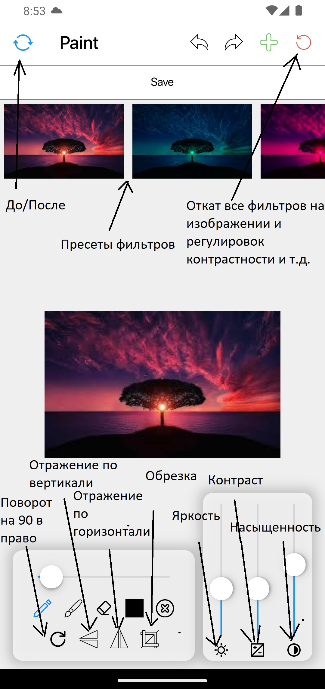

# Paint

Небольшое приложение для редактирования изображений и рисования на холсте

# Документация

* Состояние без картинки

* Состояние с картинкой

# Стек

* Стейт менеджмент - Stacked
* DI - Provider
* Локализация - easy_localization
* Навигация - auto_route
* Локальное хранилище - flutter_secure_storage
* Работа с изображением: 
  * Фильтрация, редактирование контраста и т.д. - image_editor
  * Обрезка изображения - image_cropper
* Работа с библиотекой файлов устройства
  * Выбор изображения из локального хранилища устройства - image_picker
  * Упрощает сохранение изображения именно в галлерею - gallery_saver
  * Библиотека для просмотра путей устройства - path_provider
* Рисование
  * Доска и инструменты для рисования - flutter_drawing_board
  * Красивый выбор цвета для кистей и т.д. - flutter_hsvcolor_picker
* Работа с ассетами
  * Позволяет использовать SVG - flutter_svg
  * Упрощает работу с ассетами - flutter_gen_runner

# Результаты

Приложение реализовано практически полностью по т.з. за исключением некоторых пунктов, а именно не реализовано сохранение в приложении.

План реализации сохранения: 
        Все текущее изображение хранится в {drawingController.getHistory}, это список каждого отдельного "штриха", каждый штрих следует размапать в json объект а дальше хранить в любой желаемой базе данных. При подгрузке с имеющегося файла в {drawingController} можно подать объекты "штриха", чтобы они отрисовались  на холсте и добавились в историю контроллера.

# Дополнительные фишки

* Локализация на 2 языка(русский, английский), переключить язык в приложении нельзя, он определяется языком системы
    
* Как я понял изначально подразумевалась только возможность рисовать на самом изображении, но в приложении есть возможность просто рисовать на изначальном белом полотне, также его можно сохранить на устройство

* В инструментах рисования можно не только выбрать толщину кисти, но также сменить инструмент с кисти на карандаш, карандаш делает равномерные линии, а кисть создает живую линию (лучше всего заметно на реальном устройстве)

* Вместо скрытия изображения во время аппаратного скриншота реализовано полное блокирование скриншота, сделано так, так как получаем тот же результат, а сама реализация становится гораздо проще

# Команды

Команды для генерации переводов

* flutter pub run easy_localization:generate -S "assets/translations" -O "lib/gen"

* flutter pub run easy_localization:generate -S "assets/translations" -O "lib/gen"  -o "locale_keys.g.dart" -f keys

Команды для генерации остальных автогенриуемых файлов, ресурсов

* flutter packages pub run build_runner build --delete-conflicting-outputs

# Контакты

* Telegram - https://t.me/whiskas44
